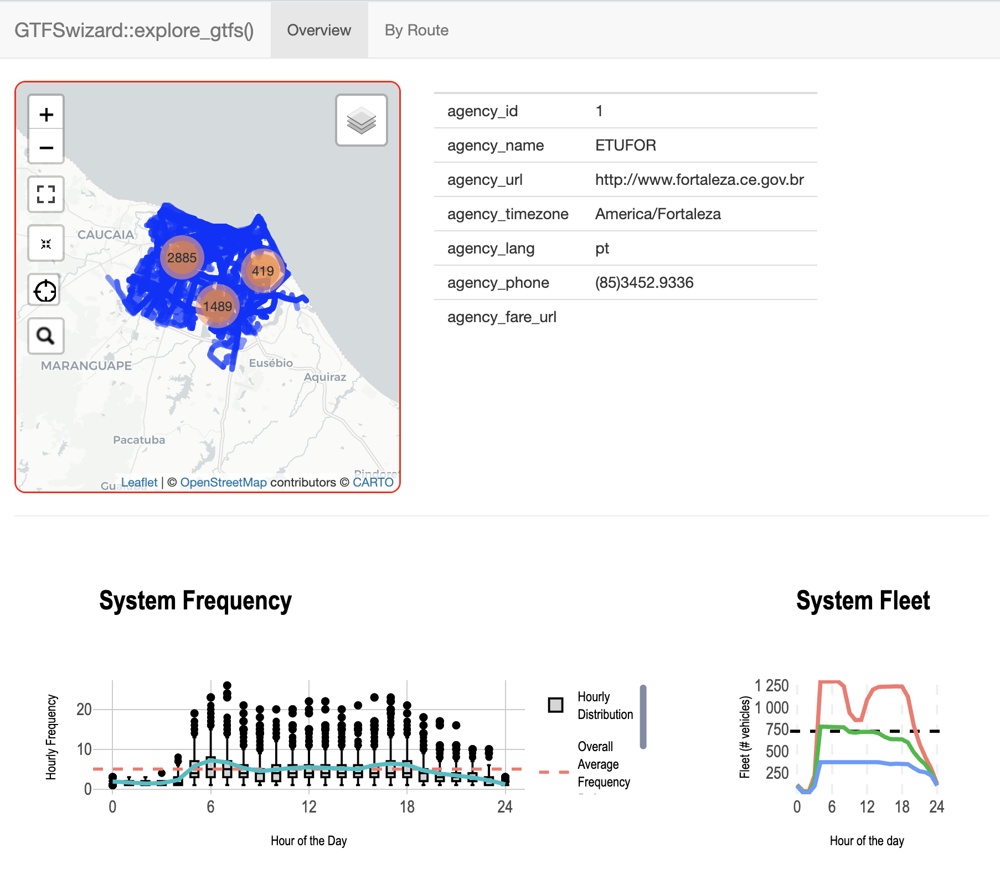
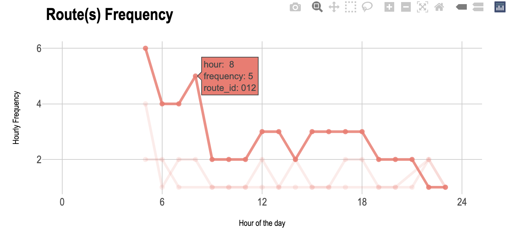
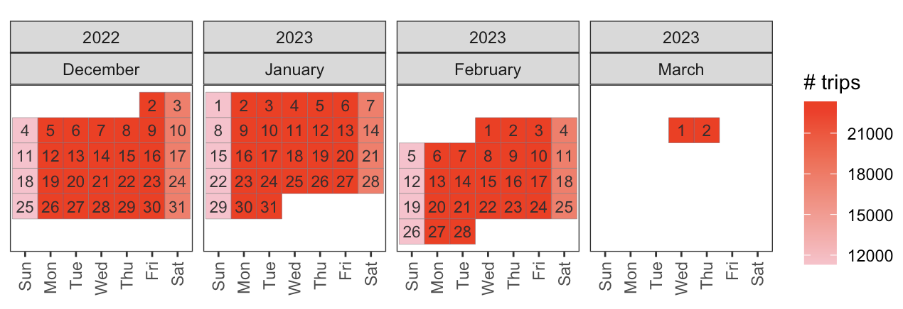
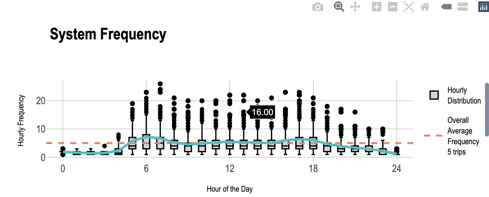
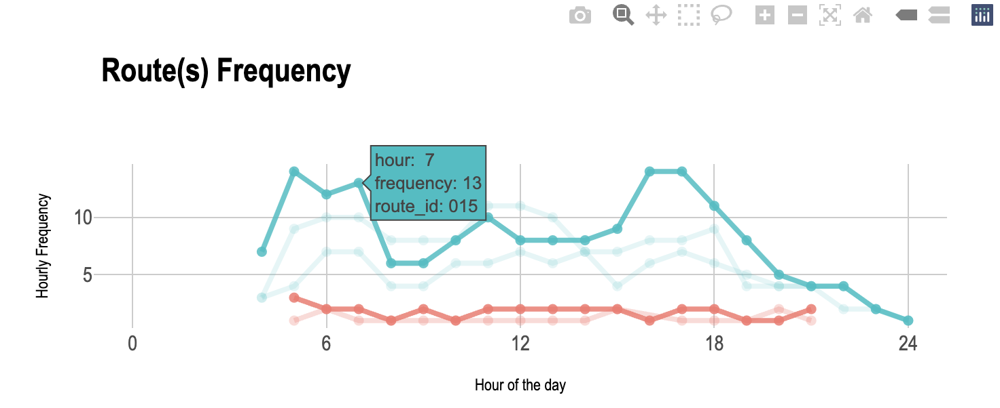
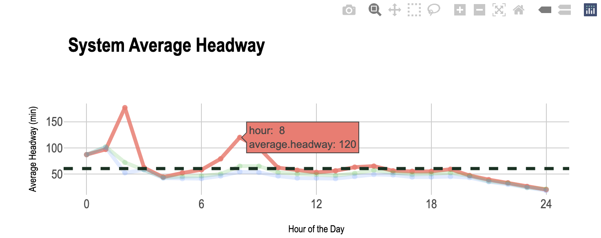

# GTFSwizard 

[](https://lifecycle.r-lib.org/articles/stages.html)

[](https://CRAN.R-project.org/package=GTFSwizard) <br />

GTFSwizard is a set of tools for exploring and manipulating [General Transit Feed Specification (GTFS)](https://gtfs.org/) files in R.

Its main purpose is to provide researchers and practitioners with a seamless and easy way to visually explore and simulate changes within a GTFS file, which represent public transportation schedules and geographic data. The package allows users to filter data by routes, trips, stops, and time, generate spatial visualizations, and perform detailed analyses of transit networks, including headway, dwell times, and route frequencies. Editing functions to delay and split trips, and to merge distictins GTFS, are available. This is an ongoing work and new features are planned to be featured soon.

## Installation
``` r
install.packages("GTFSwizard")
library(GTFSwizard)

# dev version:
install.packages('remotes') # if not already installed
# wait for the installation to complete

remotes::install_github('OPATP/GTFSwizard@main')
library(GTFSwizard)
```
## Basics
GTFS feeds are read using the `read_gtfs()` function. `read_gtfs()` returns a `wizardgtfs` object, which is a slightly improved `gtfs` object. You can also convert a regular `gtfs` object to a `wizardgtfs` object using the `as_wizardgtfs()` function. You can take a glance at the feed using the base `summary()` function.
``` r
library(GTFSwizard)

gtfs <- GTFSwizard::read_gtfs('path-to-gtfs.zip') # or
gtfs <- GTFSwizard::as_wizardgtfs(gtfs_obj)

names(gtfs)
# [1] "agency"          "calendar"
# [3] "calendar_dates"  "fare_attributes"
# [5] "fare_rules"      "routes"
# [7] "shapes"          "stop_times"
# [9] "stops"           "trips"
# [11] "dates_services"

class(gtfs)
# [1] "wizardgtfs" "gtfs" "list"

summary(gtfs)
#A wizardgtfs object with:  

#10  GTFS tables 
#With the following names and respective numbers of entries in each: 
#         agency        calendar  calendar_dates fare_attributes 
#              1               3               6               2 
#     fare_rules          routes          shapes      stop_times 
#            345             345          125776         2659737 
#          stops           trips 
#           4676           85410 
#345  routes 
#4676  stops 
#85410  trips 
#823  valid days of service 
#271.4  meters is the average distance between sequencial stops in a given route 
```

GTFS feeds are mainly browsed using the `explore_gtfs()` function. It pops-up an informative and interactive dashboard.
``` r
GTFSwizard::explore_gtfs(for_bus_gtfs)
```



## Service Patterns
The concept of a `service_pattern` in GTFSwizard helps to address a common limitation of GTFS: its lack of a standardized way to distinguish distinct service patterns within the same route. GTFS files can have multiple `service_ids` for trips within the same route on the same day, such as regular and extra services. However, GTFS does not inherently identify unique service patterns, _i.e._ unique set of `service_id`s.

In `wizardgtfs` objects, the `dates_services` table is an extended feature that consolidates dates and associated `service_id`s into a single, organized table. This table is not standard in typical GTFS files but is added specifically in `wizardgtfs` objects. The `dates_services` table is structured so that each date is associated with a `list` of `service_id`s representing the transit services operating on that specific day. Essentially, each unique `list` of `service_id`s observed across dates defines a distinct `service pattern`. It is common to observe at least 3 service patterns: weekdays, saturdays and sundays.

- Structure of `dates_services`: Each date in the `dates_service`s table has an associated `list` of `service_id`s, capturing the set of services active on that particular day.
- Defining Service Patterns: A unique `service_pattern` is identified by a unique combination of `service_id`s operating on a given date. For instance, if two dates share the exact same `service_id`s, they are considered part of the same `service_pattern`.

You can check `service_pattern` using the `get_servicepattern()` function.

``` r
GTFSwizard::get_servicepattern(for_bus_gtfs)
## A tibble: 3 × 3
#  service_id service_pattern  pattern_frequency
#  <chr>      <fct>                        <int>
#1 U          servicepattern-1                65
#2 S          servicepattern-2                13
#3 D          servicepattern-3                13
```

Most of the functions will account for service_patterns, _e.g._ `get_frequency()` and `plot_routefrequency()`. The former arrange service_pattern from most frequent (typical day) to less frequent (rarer day), while the latter highligths the most frequent service pattern.
```r
GTFSwizard::get_frequency(for_bus_gtfs)
## A tibble: 667 × 4
#   route_id daily.frequency service_pattern  pattern_frequency
#   <chr>              <int> <fct>                        <int>
# 1 004                   66 servicepattern-1                65
# 2 011                   53 servicepattern-1                65
# 3 011                   30 servicepattern-2                13
# 4 011                   17 servicepattern-3                13
# 5 012                   53 servicepattern-1                65
# 6 012                   28 servicepattern-2                13
# 7 012                   20 servicepattern-3                13
# 8 014                   30 servicepattern-1                65
# 9 014                   19 servicepattern-2                13
#10 014                   19 servicepattern-3                13
## ℹ 657 more rows
## ℹ Use `print(n = ...)` to see more rows

GTFSwizard::plot_routefrequency(for_bus_gtfs, route = for_bus_gtfs$routes$route_id[3])
```



You can use `plot_calendar()` to check the numer of trips along the calendar and get a better sense of the `service_pattern` rationale.
``` r
GTFSwizard::plot_calendar(for_bus_gtfs)
```



## Exploring

Routes, frequency, headways, dell times, speeds, shapes, stops, durations, distances, and fleet are retrieved using the `get_frequency()`, the `get_headways()`, the `get_dwelltimes()`, the `get_duration()`, the `get_distances()`, the `get_speed()`, and the `get_fleet()` functions. These functions support several `methods`, such as `by.trip` or `detailed`. Refer to documentation `?` for more information.

``` r
GTFSwizard::get_headways(for_bus_gtfs, method = 'by.hour')
#This method assumes constant headways along stops.
## A tibble: 75 × 5
#   hour  trips average.headway service_pattern  pattern_frequency
#   <chr> <int>           <dbl> <fct>                        <int>
# 1 00       15           5248  servicepattern-1                65
# 2 00       15           5248  servicepattern-2                13
# 3 00       15           5248  servicepattern-3                13
# 4 01       15           5848  servicepattern-1                65
# 5 01       14           6107. servicepattern-2                13
# 6 01       14           6060  servicepattern-3                13
# 7 02        6          10610  servicepattern-1                65
# 8 02        6           4320  servicepattern-2                13
# 9 02        5           3132  servicepattern-3                13
#10 03        7           3720  servicepattern-1                65
## ℹ 65 more rows
## ℹ Use `print(n = ...)` to see more rows

GTFSwizard::get_dwelltimes(for_bus_gtfs, max.dwelltime = 60, method = 'by.trip')
## A tibble: 52,304 × 5
#   route_id trip_id          average.dwelltime service_pattern  pattern_frequency
#   <chr>    <chr>                        <dbl> <fct>                        <int>
# 1 004      U004-T01V01B01-I                 0 servicepattern-1                65
# 2 004      U004-T01V01B01-V                 0 servicepattern-1                65
# 3 004      U004-T01V02B01-I                 0 servicepattern-1                65
# 4 004      U004-T01V02B01-V                 0 servicepattern-1                65
# 5 004      U004-T01V03B01-I                 0 servicepattern-1                65
# 6 004      U004-T01V03B01-V                 0 servicepattern-1                65
# 7 004      U004-T01V04B01-I                 0 servicepattern-1                65
# 8 004      U004-T01V04B01-V                 0 servicepattern-1                65
# 9 004      U004-T02V01B01-I                 0 servicepattern-1                65
#10 004      U004-T02V01B01-V                 0 servicepattern-1                65
## ℹ 52,294 more rows
## ℹ Use `print(n = ...)` to see more rows

GTFSwizard::get_durations(for_bus_gtfs, method = 'detailed')
## A tibble: 1,398,251 × 8
#   route_id trip_id          hour  from_stop_id to_stop_id duration service_pattern 
#   <chr>    <chr>            <chr> <chr>        <chr>         <dbl> <fct>           
# 1 011      D011-T01V01B01-I 05    7038         1015             60 servicepattern-3
# 2 011      D011-T01V01B01-I 05    1015         4251             60 servicepattern-3
# 3 011      D011-T01V01B01-I 05    4251         990              60 servicepattern-3
# 4 011      D011-T01V01B01-I 05    990          6182             60 servicepattern-3
# 5 011      D011-T01V01B01-I 05    6182         989             120 servicepattern-3
# 6 011      D011-T01V01B01-I 05    989          1600            120 servicepattern-3
# 7 011      D011-T01V01B01-I 05    1600         1608             60 servicepattern-3
# 8 011      D011-T01V01B01-I 05    1608         4767            120 servicepattern-3
# 9 011      D011-T01V01B01-I 05    4767         6450             60 servicepattern-3
#10 011      D011-T01V01B01-I 05    6450         2055            120 servicepattern-3
## ℹ 1,398,241 more rows
## ℹ 1 more variable: pattern_frequency <int>
## ℹ Use `print(n = ...)` to see more rows

GTFSwizard::get_distances(for_bus_gtfs, method = 'by.trip')
## A tibble: 52,304 × 5
#   route_id trip_id          distance service_pattern  pattern_frequency
#   <chr>    <chr>                 [m] <fct>                        <int>
# 1 011      D011-T01V01B01-I   17348. servicepattern-3                13
# 2 011      D011-T01V02B01-I   17348. servicepattern-3                13
# 3 011      D011-T01V03B01-I   17348. servicepattern-3                13
# 4 011      D011-T01V04B01-I   17348. servicepattern-3                13
# 5 011      D011-T01V05B01-I   17348. servicepattern-3                13
# 6 011      D011-T01V06B01-I   17348. servicepattern-3                13
# 7 011      D011-T01V07B01-I   17348. servicepattern-3                13
# 8 011      D011-T01V08B01-I   17348. servicepattern-3                13
# 9 011      D011-T01V09B01-I   17348. servicepattern-3                13
#10 011      D011-T01V10B01-I   17348. servicepattern-3                13
## ℹ 52,294 more rows
## ℹ Use `print(n = ...)` to see more rows

GTFSwizard::get_distances(for_bus_gtfs, method = 'by.route')
## A tibble: 667 × 5
#   route_id trips average.distance service_pattern  pattern_frequency
#   <chr>    <int>              [m] <fct>                        <int>
# 1 004         66           18664. servicepattern-1                65
# 2 011         53           17348. servicepattern-1                65
# 3 011         30           17348. servicepattern-2                13
# 4 011         17           17348. servicepattern-3                13
# 5 012         53           17013. servicepattern-1                65
# 6 012         28           17013. servicepattern-2                13
# 7 012         20           17013. servicepattern-3                13
# 8 014         30           11897. servicepattern-1                65
# 9 014         19           11897. servicepattern-2                13
#10 014         19           11897. servicepattern-3                13
## ℹ 657 more rows
## ℹ Use `print(n = ...)` to see more rows

GTFSwizard::get_speeds(for_bus_gtfs, method = 'by.route')
## A tibble: 667 × 5
#   route_id trips average.speed service_pattern  pattern_frequency
#   <chr>    <int>         <dbl> <fct>                        <int>
# 1 004          1          17.4 servicepattern-1                65
# 2 011          3          13.2 servicepattern-1                65
# 3 011          3          15.0 servicepattern-2                13
# 4 011          3          15.7 servicepattern-3                13
# 5 012          3          14.6 servicepattern-1                65
# 6 012          3          14.3 servicepattern-2                13
# 7 012          3          17.8 servicepattern-3                13
# 8 014          3          12.4 servicepattern-1                65
# 9 014          3          14.3 servicepattern-2                13
#10 014          3          14.3 servicepattern-3                13
## ℹ 657 more rows
## ℹ Use `print(n = ...)` to see more rows

GTFSwizard::get_fleet(for_bus_gtfs, method = 'peak')
#This method returns the number of simultaneous trips for the three busiest hours.
## A tibble: 9 × 4
## Groups:   service_pattern [3]
#   hour fleet service_pattern  pattern_frequency
#  <dbl> <int> <fct>                        <int>
#1     7  1296 servicepattern-1                65
#2     6  1295 servicepattern-1                65
#3     4  1294 servicepattern-1                65
#4     7   783 servicepattern-2                13
#5     6   782 servicepattern-2                13
#6     4   780 servicepattern-2                13
#7     7   381 servicepattern-3                13
#8     6   380 servicepattern-3                13
#9     4   374 servicepattern-3                13
```
## Filtering
Filtering tools allows customized GTFS data by service patterns, specific dates, service IDs, route IDs, trip IDs, stop IDs, and time ranges. These `filter_` functions help retain only the relevant data, making analysis easier and more focused.

- `filter_servicepattern()`: Filter by specified service patterns. Defaults to the most frequent pattern (typical day) if none is provided.
- `filter_date()`: Filter data by specific dates, returning only services active on those dates.
- `filter_service()`: Filter by specific service IDs to retain.
- `filter_route()`: Filter by route ID. Set `keep = TRUE` to retain specified routes or `keep = FALSE` to exclude them.
- `filter_trip()`: Filter by trip ID. Set `keep = TRUE` to retain specified trips or `keep = FALSE` to exclude them.
- `filter_stop()`: Filter by stop ID, keeping only associated stops and related data. It is very usefull when used together with `GTFSwizard::get_stops_sf` and `sf::st_filter()`, as can geographically filter GTFS data.
- `filter_time()`: Filter by a specified time range (`from` and `to`).

``` r
# Filter by service pattern
filtered_gtfs <- GTFSwizard::filter_servicepattern(for_bus_gtfs, "servicepattern-2")

# Filter by specific date
filtered_gtfs <- GTFSwizard::filter_date(for_bus_gtfs, "2023-01-01")

# Filter by route ID, retaining only specified routes
filtered_gtfs <- GTFSwizard::filter_route(for_bus_gtfs, for_bus_gtfs$routes$route_id[1:2])

# Filter by trip ID, excluding specified trips
filtered_gtfs <- GTFSwizard::filter_trip(for_bus_gtfs, for_bus_gtfs$trips$trip_id[1:2], FALSE)

# Filter by time range
filtered_gtfs <- GTFSwizard::filter_time(gtfs = for_bus_gtfs, "06:30:00", "10:00:00")

# Spatial filter using filter_stop
spatial-filter <- GTFSwizard::get_shapes_sf(for_bus_gtfs$shapes)

stops <- sf::st_filter(GTFSwizard::get_stops_sf(for_bus_gtfs$stops),
                       spatial-filter) |>
          dplyr::pull(stop_id)

filtered_gtfs <- GTFSwizard::filter_stop(for_bus_gtfs, stops)
```

## Visualizing
GTFSwizard offers interactive plotting tools to analyze trip frequencies and headways, providing insight into peak hours, route-specific patterns, and system-wide trends.

- System Frequency by Hour: `plot_frequency()` shows the distribution of trip frequencies by hour, with hourly and overall averages to highlight peak service times.
``` r
GTFSwizard::plot_frequency(for_bus_gtfs)
```


- Route Frequency by Hour: `plot_routefrequency()` displays frequency by hour for selected routes, illustrating different service patterns.
``` r
GTFSwizard::plot_routefrequency(for_bus_gtfs, route = for_bus_gtfs$routes$route_id[4:5])
```


- System Average Headway by Hour: `plot_headways()` shows average time between trips, highlighting hourly and overall headways to visualize service intervals.
``` r
GTFSwizard::plot_headways(for_bus_gtfs)
```


## Editing
GTFSwizard provides functions to edit GTFS data directly - for delaying, splitting, and merging trips. The `delay_trip()` function allows users to apply a delay to specific trips. The `split_trip()` function equally divides a trip in `split` number of points, creating `split + 1` separate trips. This can be useful for analyzing partial routes or for simulating route adjustments. The `merge_gtfs()` function combines two GTFS files, allowing for the integration of distinct GTFS datasets into a single dataset.

```r
# Delay trips by 5 minutes (300 seconds)
delayed_gtfs <- delay_trip(for_bus_gtfs, trip_id = for_bus_gtfs$trips$trips_id[1:2], delay = 300)

# Split a trip in 3 sections (2 splits)
split_gtfs <- split_trip(for_bus_gtfs, trip_id = for_bus_gtfs$trips$trip_id[1:2], split = 2)

# Merge two GTFS files into one
merged_gtfs <- merge_gtfs(for_bus_gtfs, for_rail_gtfs)
```

Please note that `split_trip()` uses stop sequences to recreate the shapes table of split trips; accordingly, it should not be used after `filter_time()`, as this function removes invalid `stop_times`.

Feeds are, then, exported using the `write_gtfs()` function. It saves a standard GTFS `.zip` file, located as declared.
``` r
GTFSwizard::write_gtfs(for_bus_gtfs, 'path-to-file.zip')
```

## Handling Geographic Data
GTFSwizard autodetects and reconstructs missing shape tables using the `get_shapes()` function. Variations of this function can create `simple feature` objects from `stops` or `shapes` tables, using `get_stops_sf()` or `get_shapes_sf()` functions, or even standard GTFS `shapes` data frame tables from `simple feature` shapes objects, using `get_shapes_df()` function. Please note that `get_shapes()` uses stop sequences to recreate the shapes table; accordingly, it should not be used after `filter_time()`, as this function removes invalid `stop_times`.

``` r
gtfs <- for_bus_gtfs

gtfs$shapes <- NULL

gtfs$shapes
#NULL

gtfs <- GTFSwizard::get_shapes(gtfs)

gtfs$shapes
## A tibble: 6,830 × 5
#   shape_id shape_pt_lon shape_pt_lat shape_pt_sequence shape_dist_traveled
#   <chr>           <dbl>        <dbl>             <int>               <dbl>
# 1 shape-1         -38.7        -3.96                 1                  0 
# 2 shape-1         -38.7        -3.95                 2                499.
# 3 shape-1         -38.7        -3.96                 3               1428 
# 4 shape-1         -38.7        -3.98                 4               3404.
# 5 shape-1         -38.7        -3.97                 5               5490.
# 6 shape-1         -38.7        -3.97                 6               6248.
# 7 shape-1         -38.7        -3.98                 7               7871.
# 8 shape-1         -38.8        -3.97                 8              11398.
# 9 shape-1         -38.7        -3.97                 9              13093.
#10 shape-1         -38.8        -3.97                10              13395 
## ℹ 6,820 more rows
## ℹ Use `print(n = ...)` to see more rows

GTFSwizard::get_shapes_sf(for_bus_gtfs$shapes)
#Simple feature collection with 509 features and 2 fields
#Geometry type: LINESTRING
#Dimension:     XY
#Bounding box:  xmin: -38.65624 ymin: -3.897338 xmax: -38.41016 ymax: -3.694365
#Geodetic CRS:  WGS 84
# A tibble: 509 × 2
#   shape_id                                                                        geometry
#   <chr>                                                                   <LINESTRING [°]>
# 1 shape004-I (-38.50181 -3.831178, -38.50185 -3.831165, -38.50242 -3.831016, -38.50177 -3…
# 2 shape004-V (-38.4845 -3.738462, -38.48455 -3.738554, -38.48457 -3.738583, -38.48468 -3.…
# 3 shape011-I (-38.53249 -3.722036, -38.53255 -3.722017, -38.53286 -3.721924, -38.53297 -3…
# 4 shape012-V (-38.53251 -3.722151, -38.53242 -3.722182, -38.53195 -3.722339, -38.53178 -3…
# 5 shape014-V (-38.53121 -3.757169, -38.53111 -3.757062, -38.53102 -3.756946, -38.53095 -3…
# 6 shape015-I (-38.60755 -3.772986, -38.60752 -3.772894, -38.60741 -3.772499, -38.60732 -3…
# 7 shape015-V (-38.58454 -3.737546, -38.58455 -3.73752, -38.58455 -3.737483, -38.58459 -3.…
# 8 shape016-I (-38.58995 -3.709432, -38.59 -3.709269, -38.59003 -3.70917, -38.59009 -3.708…
# 9 shape016-V (-38.48468 -3.738597, -38.48476 -3.738568, -38.48484 -3.738538, -38.48563 -3…
#10 shape017-I (-38.47904 -3.796202, -38.47898 -3.796908, -38.47975 -3.796987, -38.47983 -3…
## ℹ 499 more rows
## ℹ Use `print(n = ...)` to see more rows

GTFSwizard::get_stops_sf(for_bus_gtfs$stops)
#Simple feature collection with 4793 features and 3 fields
#Geometry type: POINT
#Dimension:     XY
#Bounding box:  xmin: -38.64515 ymin: -3.894503 xmax: -38.4108 ymax: -3.694365
#Geodetic CRS:  WGS 84
## A tibble: 4,793 × 4
#   stop_id stop_name                      wheelchair_boarding              geometry
#   <chr>   <chr>                                        <int>           <POINT [°]>
# 1 10      AVENIDA CEL CARVALHO, 1135                      NA  (-38.5906 -3.702286)
# 2 1000    RUA DOR JOAO MOREIRA, 489                       NA (-38.52899 -3.722157)
# 3 1001    RUA DOR JOAO MOREIRA, 163                       NA (-38.52601 -3.723169)
# 4 1009    AVENIDA TRISTÃO GONÇALVES, 500                  NA (-38.53285 -3.725926)
# 5 1010    AVENIDA IMPERADOR, 550                          NA (-38.53421 -3.726137)
# 6 1013    AVENIDA IMPERADOR, 262                          NA  (-38.53348 -3.72369)
# 7 1014    RUA SAO PAULO, 955                              NA (-38.53403 -3.723879)
# 8 1015    RUA GUILHERME ROCHA, 1048                       NA (-38.53547 -3.724543)
# 9 1016    RUA GAL SAMPAIO, 951                            NA  (-38.53078 -3.72682)
#10 102     RUA BETA, 202                                   NA  (-38.60078 -3.71436)
## ℹ 4,783 more rows
## ℹ Use `print(n = ...)` to see more rows
```

## Objects
GTFSwizard features two toy examples, a small `for_rail_gtfs` `wizardgtfs` object, and a rather bigger `for_bus_gtfs` `wizardgtfs` object. They are real GTFS samples, the first being the urban subway system, and the second one the regular bus system; both for the city of Fortaleza, Brazil, on the 2020's.
``` r
gtfs <- GTFSwizard::for_bus_gtfs

plot(gtfs)
```


## Cheat Sheet
_Under development..._

## Contributing
Contributions are welcome! To report a bug, suggest a feature, or contribute code, please use the repository’s [Issues](https://github.com/OPATP/GTFSwizard/issues).

## Related Packages
GTFSwizard mainly relies on [dplyr](https://dplyr.tidyverse.org/) and [sf](https://r-spatial.github.io/sf/) for data wrangling, [leaflet](https://leafletjs.com/) for map rendering, [ggplot2](https://ggplot2.tidyverse.org/) and [plotly](https://plotly.com/r/) for data visualization, and [shiny](https://shiny.posit.co/) for the `explore_gtfs()` application assembling.

## Citation
To cite package ‘GTFSwizard’ in publications use:

- Quesado Filho N, Guimarães C (2024). _GTFSwizard: Exploring and Manipulating 'GTFS' Files_. R package version 1.0.0, <https://github.com/nelsonquesado/GTFSwizard>.

A BibTeX entry for LaTeX users is
``` tex
  @Manual{quesado.guimaraes.2024,
    title = {GTFSwizard: Exploring and Manipulating GTFS Files},
    author = {Nelson de O. {Quesado Filho} and Caio G. C. Guimarães},
    year = {2024},
    note = {R package version 1.0.0},
    url = {https://github.com/nelsonquesado/GTFSwizard},
    doi = {10.32614/CRAN.package.GTFSwizard},
  }
  ```

## Acknowledgement <a href="https://det.ufc.br/petran"></a>
**GTFSwizard** is developed by [Nelson Quesado](https://github.com/nelsonquesado/) and [Caio Guimarães](https://github.com/cgmobility) at OPA-TP research group, Universidade Federal do Ceará.
