# GTFSwizard 
##### Development version 1.2.1 (2026-06-21)
##### CRAN version 1.2.0 (2026-06-16)

[](https://lifecycle.r-lib.org/articles/stages.html)
[](https://github.com/OPATP/GTFSwizard)
[](https://CRAN.R-project.org/package=GTFSwizard)
[](https://github.com/OPATP/GTFSwizard/actions/workflows/rhub.yaml)
[](https://app.codecov.io/gh/OPATP/GTFSwizard)
[](https://CRAN.R-project.org/package=GTFSwizard)
[](https://CRAN.R-project.org/package=GTFSwizard)
[](https://CRAN.R-project.org/package=GTFSwizard)

GTFSwizard is a set of tools for creating, exploring, and manipulating [General Transit Feed Specification (GTFS)](https://gtfs.org/) files in R.

Its main purpose is to provide researchers and practitioners with a seamless and easy way to visually explore and simulate changes within GTFS files, which represent public transportation schedules and geographic data. The package allows users to filter data by routes, trips, stops, and time, generate spatial visualizations, and perform detailed analyses of transit networks, including headway, dwell times, route frequencies, travel times, corridors and hubs. Editing functions to delay, speed change, and split trips, and to merge distinct GTFS are available. This is an ongoing work and new features are planned to be implemented soon.

## Installation
The development version is **1.2.1**. The CRAN version is **1.2.0**.

``` r
# CRAN version:
install.packages("GTFSwizard")
library(GTFSwizard)

# Development version:
install.packages('remotes') # if not already installed
remotes::install_github('OPATP/GTFSwizard@main')
library(GTFSwizard)
```
## Basics
Use `read_gtfs()` to read an existing feed, `as_wizardgtfs()` to convert a GTFS list, and `create_gtfs()` to build and validate a feed from data frames. Each function returns a `wizardgtfs` object.

``` r
library(GTFSwizard)

gtfs <- GTFSwizard::read_gtfs('path-to-gtfs.zip') # or
gtfs <- GTFSwizard::as_wizardgtfs(gtfs_obj)

created_gtfs <- GTFSwizard::create_gtfs(
  agency = data.frame(
    agency_id = "A", agency_name = "Demo Transit",
    agency_url = "https://example.com",
    agency_timezone = "America/Fortaleza"
  ),
  routes = data.frame(
    route_id = "R1", agency_id = "A", route_short_name = "1",
    route_long_name = "Central", route_type = 3
  ),
  trips = data.frame(route_id = "R1", service_id = "WK", trip_id = "T1"),
  stop_times = data.frame(
    trip_id = "T1", arrival_time = c("08:00:00", "08:10:00"),
    departure_time = c("08:00:00", "08:10:00"),
    stop_id = c("S1", "S2"), stop_sequence = 1:2
  ),
  stops = data.frame(
    stop_id = c("S1", "S2"), stop_name = c("First", "Second"),
    stop_lat = c(-3.73, -3.74), stop_lon = c(-38.52, -38.53)
  ),
  calendar = data.frame(
    service_id = "WK", monday = 1, tuesday = 1, wednesday = 1,
    thursday = 1, friday = 1, saturday = 0, sunday = 0,
    start_date = "20260101", end_date = "20261231"
  )
)

summary(for_bus_gtfs)
# <summary.wizardgtfs>
#   Agency: ETUFOR
#   Service: 2019-09-13 to 2021-12-13 (823 active dates)
#   345 routes; 85410 trips; 4676 stops; 675 shapes
#   Median consecutive-stop spacing: 268.2 m
#
# Tables:
#          agency        calendar  calendar_dates fare_attributes      fare_rules 
#               1               3               6               2             345 
#          routes          shapes      stop_times           stops           trips 
#             345          125776         2659737            4676           85410
```

`explore_gtfs()` opens an interactive dashboard with maps and planning and operational views. Omit the argument to choose a GTFS `.zip` file in a browse window.
``` r
GTFSwizard::explore_gtfs(for_bus_gtfs)
GTFSwizard::explore_gtfs()
```

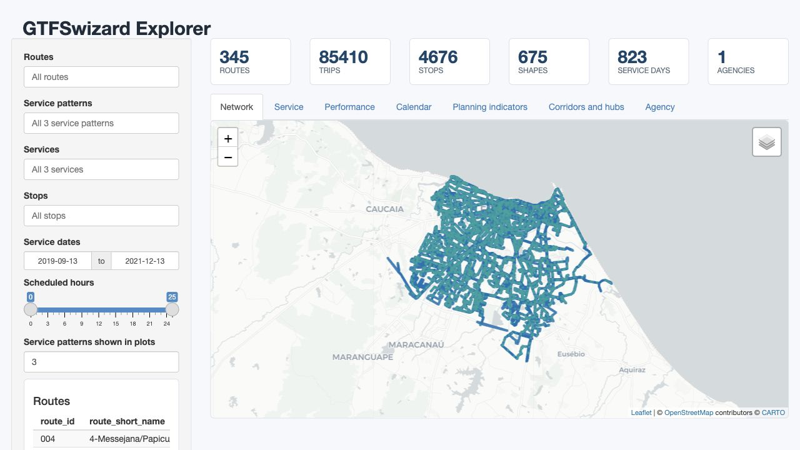

## Service Patterns
The concept of a `service_pattern` in GTFSwizard helps to address a common limitation of GTFS: its lack of a standardized way to distinguish distinct service patterns within the same route. GTFS files can have multiple `service_ids` for trips within the same route on the same day, such as regular and extra services. However, GTFS does not inherently identify unique service patterns, _i.e._ unique set of `service_id`s.

In `wizardgtfs` objects, the `dates_services` table is an extended feature that consolidates dates and associated `service_id`s into a single, organized table. This table is not standard in typical GTFS files but is added specifically in `wizardgtfs` objects. The `dates_services` table is structured so that each date is associated with a `list` of `service_id`s representing the transit services operating on that specific day. Essentially, each unique `list` of `service_id`s observed across dates defines a distinct `service pattern`. It is common to observe at least 3 service patterns: weekdays, saturdays and sundays. Dates inside the feed calendar range with no active services are treated as an explicit empty service set: trip counts are `0`, and the calendar-level pattern is labeled `"No service"`.

- Structure of `dates_services`: Each date in the `dates_service`s table has an associated `list` of `service_id`s, capturing the set of services active on that particular day.
- Defining Service Patterns: A unique `service_pattern` is identified by a unique combination of `service_id`s operating on a given date. For instance, if two dates share the exact same `service_id`s, they are considered part of the same `service_pattern`.
- No-service dates: A date with no active `service_id`s is represented as the `"No service"` pattern in calendar-level outputs and by `get_servicepattern()` with `service_id = NA`. It is not a trip-bearing pattern and cannot be used with `filter_servicepattern()`.

You can check `service_pattern` using the `get_servicepattern()` function.

``` r
GTFSwizard::get_servicepattern(for_bus_gtfs)
## A tibble: 3 × 3
#  service_id service_pattern  pattern_frequency
#  <chr>      <chr>                        <int>
#1 U          servicepattern-1               586
#2 D          servicepattern-2               121
#3 S          servicepattern-3               116
```

Most of the functions will account for service_patterns, _e.g._ `get_frequency()` and `plot_routefrequency()`. The former arrange service_pattern from most frequent (typical day) to less frequent (rarer day), while the latter highlights the most frequent service pattern.
```r
GTFSwizard::get_frequency(for_bus_gtfs, method = "by_route")
## A tibble: 1,763 × 5
#  route_id direction_id service_pattern  pattern_frequency daily.frequency
#  <chr>           <dbl> <chr>                        <int>           <int>
#1 004                 0 servicepattern-1               586              22
#2 004                 1 servicepattern-1               586              23
#3 011                 1 servicepattern-1               586              95
#4 011                 1 servicepattern-2               121              43
#5 011                 1 servicepattern-3               116              73
#6 012                 0 servicepattern-1               586             102
## ℹ 1,757 more rows
## ℹ Use `print(n = ...)` to see more rows

GTFSwizard::plot_routefrequency(for_bus_gtfs, route = for_bus_gtfs$routes$route_id[3])
```

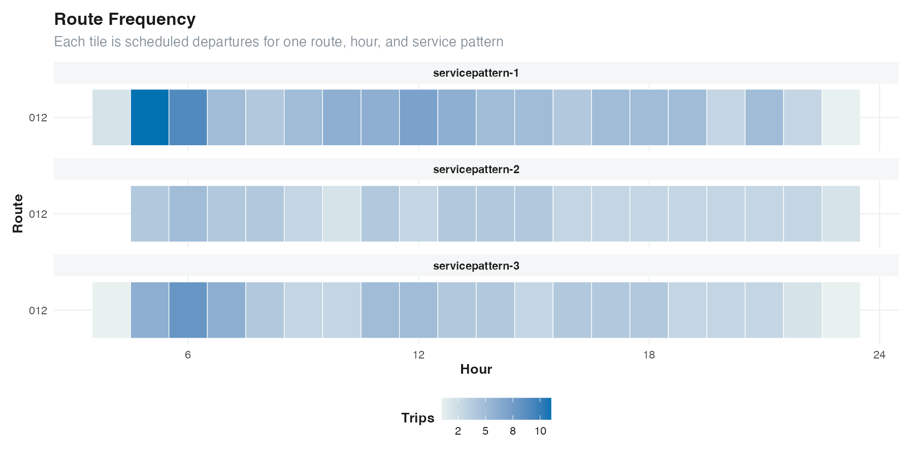

You can use `plot_calendar()` to check the number of trips along the calendar and get a better sense of the `service_pattern` rationale. Dates without active service appear as `0` trips in trip-count mode and as `"No service"` in service-pattern mode.
``` r
GTFSwizard::plot_calendar(for_bus_gtfs, facet_by_year = TRUE)
```

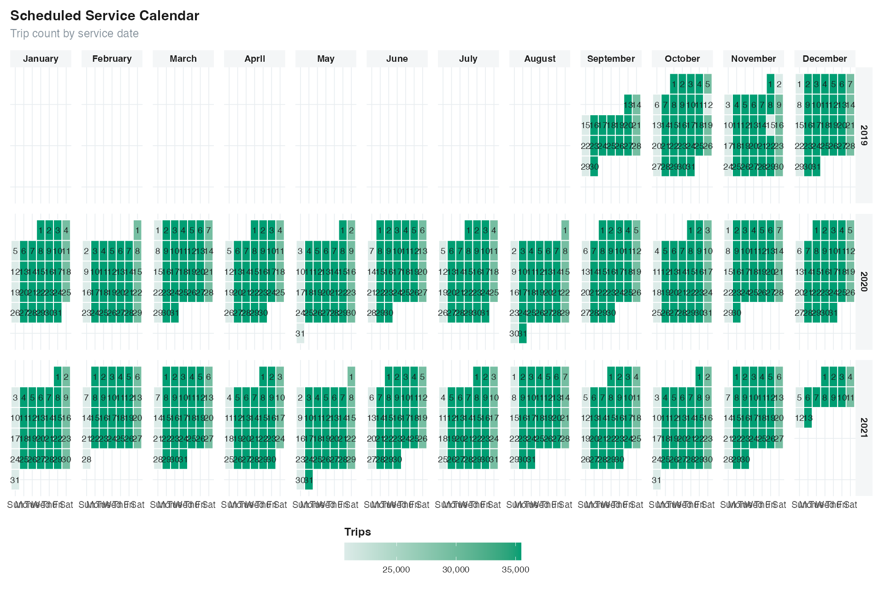

## Exploring

Frequency, headways, dwell times, speeds, durations, distances, fleet requirements, first departures, corridors, and hubs can be calculated directly from the schedule. Several functions support aggregation methods such as `by_trip`, `by_route`, `by_hour`, and `detailed`; see each function's help page for its exact observational unit.

``` r
GTFSwizard::get_headways(for_bus_gtfs, method = 'by_hour')
## A tibble: 73 × 5
#   hour service_pattern  pattern_frequency headway_minutes valid_trips
#  <dbl> <chr>                        <int>           <dbl>       <int>
#1     0 servicepattern-1               586            11.6           8
#2     0 servicepattern-2               121            11.6           8
#3     0 servicepattern-3               116            11.6           8
#4     1 servicepattern-1               586            64.4          32
#5     1 servicepattern-2               121            64.4          32
#6     1 servicepattern-3               116            64.4          32
## ℹ 67 more rows
## ℹ Use `print(n = ...)` to see more rows

GTFSwizard::get_durations(for_bus_gtfs, method = 'detailed', trips = 'all')
GTFSwizard::get_distances(for_bus_gtfs, method = 'by_trip', trips = 'all')
GTFSwizard::get_distances(for_bus_gtfs, method = 'by_route', trips = 'all')
GTFSwizard::get_speeds(for_bus_gtfs, method = 'by_route', trips = 'all')
GTFSwizard::get_fleet(for_bus_gtfs, method = 'peak')
GTFSwizard::get_1stdeparture(for_bus_gtfs)
```
Corridors and hubs are simplified representations of critical links and nodes on transit networks.

- Corridors: the `get_corridor()` and `plot_corridor()` functions retrieves and visualizes high-density transit sections.

``` r
GTFSwizard::get_corridor(for_bus_gtfs, i = .01, min_length = 1500)
# Simple feature collection with 4 features and 4 fields
# Geometry type: MULTILINESTRING
# Dimension:     XY
# Geodetic CRS:  WGS 84
# # A tibble: 4 × 5
#   corridor   stop_id   trip_id       length geometry
#   <chr>      <list>    <list>         <dbl> <MULTILINESTRING [°]>
# 1 Corridor 1 <chr [7]> <chr [3,429]>  2851. ((-38.48122 -3.781901, ...)
# 2 Corridor 2 <chr [5]> <chr [2,504]>  2214. ((-38.54677 -3.731971, ...)
# 3 Corridor 3 <chr [5]> <chr [3,470]>  2089. ((-38.48102 -3.782528, ...)
# 4 Corridor 4 <chr [7]> <chr [3,104]>  1635. ((-38.55838 -3.780695, ...)

GTFSwizard::plot_corridor(for_bus_gtfs)
```
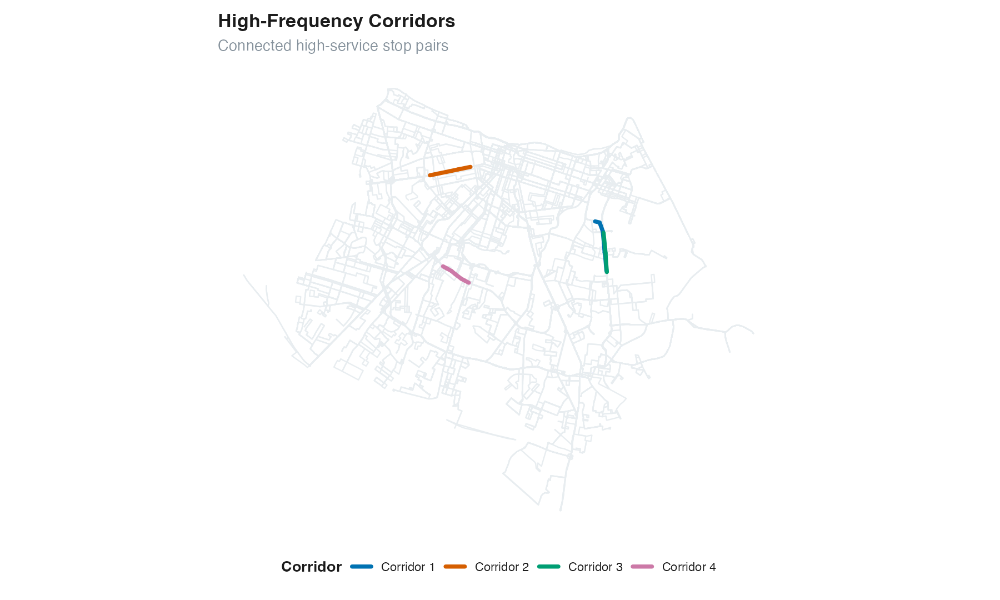

- Hubs: the `get_hubs()` and `plot_hubs()` functions retrieves and visualizes high-density transit stops.

``` r
GTFSwizard::get_hubs(for_bus_gtfs)
# Simple feature collection with 4676 features and 5 fields
# Geometry type: POINT
# # A tibble: 4,676 × 6
#   stop_id trip_id        route_id   n_trip n_routes geometry
#   <chr>   <list>         <list>      <int>    <int> <POINT [°]>
# 1 6079    <chr [14,745]> <chr [65]>  14745       65 (-38.48476 -3.738568)
# 2 4030    <chr [6,405]>  <chr [62]>   6405       62 (-38.50203 -3.830385)
# 3 6083    <chr [15,578]> <chr [56]>  15578       56 (-38.56358 -3.775878)
# 4 5822    <chr [14,364]> <chr [52]>  14364       52 (-38.58683 -3.789329)
# 5 1717    <chr [4,252]>  <chr [43]>   4252       43 (-38.5345 -3.735906)
# 6 6449    <chr [4,252]>  <chr [43]>   4252       43 (-38.53651 -3.738107)
## ℹ Use `print(n = ...)` to see more rows

GTFSwizard::plot_hubs(for_bus_gtfs)
```
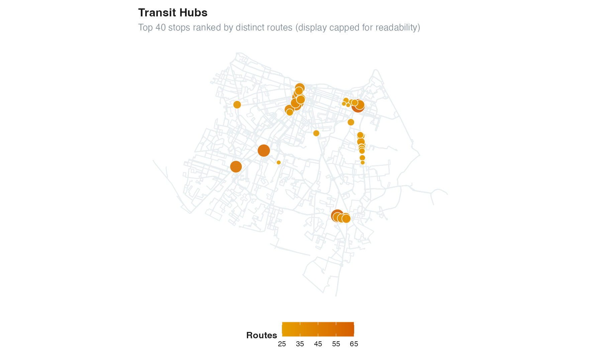

## Filtering
Filtering tools allows customization of GTFS data by service patterns, specific dates, service IDs, route IDs, trip IDs, stop IDs, and time ranges. These `filter_` functions help retain only the relevant data, making analysis easier and more focused.

- `filter_servicepattern()`: Filter by specified active service patterns. Defaults to the most frequent active pattern (typical day) if none is provided. The `"No service"` pattern describes calendar days without trips and is not accepted by this filter.
- `filter_date()`: Filter data by specific dates, returning only services active on those dates.
- `filter_service()`: Filter by specific service IDs to retain.
- `filter_route()`: Filter by route ID. Set `keep = TRUE` to retain specified routes or `keep = FALSE` to exclude them.
- `filter_trip()`: Filter by trip ID. Set `keep = TRUE` to retain specified trips or `keep = FALSE` to exclude them.
- `filter_stop()`: Keep stop calls at the requested stop IDs. Trips may remain partial, which supports route and network experiments.
- `filter_time()`: Keep stop calls inside a specified time range (`from` and `to`). Trips that cross the time boundary remain as partial trips.

``` r
# Filter by service pattern
filtered_gtfs <- GTFSwizard::filter_servicepattern(for_bus_gtfs, "servicepattern-2")

# Filter by specific date
filtered_gtfs <- GTFSwizard::filter_date(for_bus_gtfs, "2023-01-01")

# Filter by route ID, retaining only specified routes
filtered_gtfs <- GTFSwizard::filter_route(for_bus_gtfs, for_bus_gtfs$routes$route_id[1:2])

# Filter by trip ID, excluding specified trips
filtered_gtfs <- GTFSwizard::filter_trip(for_bus_gtfs, for_bus_gtfs$trips$trip_id[1:2], FALSE)

# Filter by time range
filtered_gtfs <- GTFSwizard::filter_time(gtfs = for_bus_gtfs, "06:30:00", "10:00:00")

# Spatial filter using filter_stop
spatial.filter <- GTFSwizard::get_shapes_sf(for_bus_gtfs$shapes)

stops <- sf::st_filter(GTFSwizard::get_stops_sf(for_bus_gtfs$stops),
                       spatial.filter) |>
          dplyr::pull(stop_id)

filtered_gtfs <- GTFSwizard::filter_stop(for_bus_gtfs, stops)
```

## Selecting and Grouping
`selection()` records a subset or grouping without removing any GTFS rows. Bare columns create groups in a style similar to `dplyr::group_by()`, while logical expressions restrict the records represented by the selection metadata.

``` r
# One group for each route and direction
grouped_gtfs <- GTFSwizard::selection(
  for_bus_gtfs,
  route_id,
  direction_id
)

# Group selected routes without modifying the original GTFS tables
selected_gtfs <- GTFSwizard::selection(
  for_bus_gtfs,
  route_id,
  route_id %in% for_bus_gtfs$routes$route_id[1:3]
)

attr(selected_gtfs, "selection")$groups
selected_gtfs <- GTFSwizard::unselection(selected_gtfs)
```

## Visualizing
GTFSwizard provides consistent static plots for network supply and scheduled operations. Plot subtitles and axes state the observational unit represented.

- System Frequency by Hour: `plot_frequency()` shows the distribution of trip frequencies by hour, with hourly and overall averages to highlight peak service times.
``` r
GTFSwizard::plot_frequency(for_bus_gtfs)
```
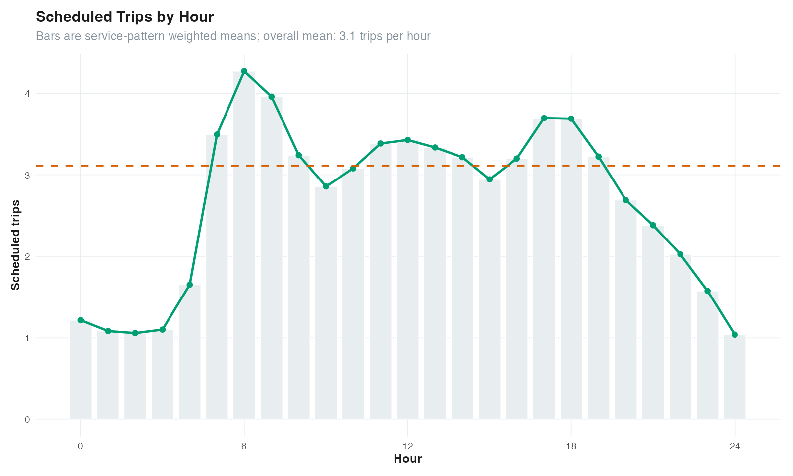

- Route Frequency by Hour: `plot_routefrequency()` displays a tile plot where fill is the number of scheduled trips by route, hour, and service pattern. Use `top_n` to keep large feeds readable.
``` r
GTFSwizard::plot_routefrequency(for_bus_gtfs, route = for_bus_gtfs$routes$route_id[4:5])
```
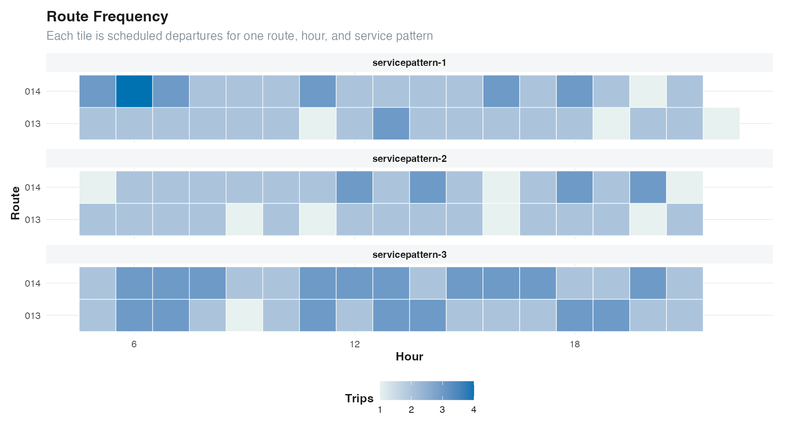

- System Average Headway by Hour: `plot_headways()` shows average time between trips, highlighting hourly and overall headways to visualize service intervals.
``` r
GTFSwizard::plot_headways(for_bus_gtfs)
```
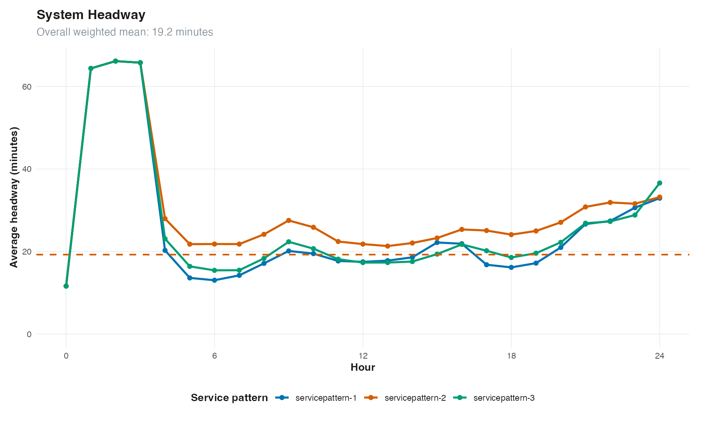

- Planning views: `plot_servicespan()` shows the first departure and final arrival for each route-service pattern, `plot_serviceheatmap()` summarizes departures by weekday and hour, `plot_routeduration()` shows scheduled trip-duration distributions, and `plot_servicesupply()` reports scheduled vehicle-hours.

``` r
GTFSwizard::plot_servicespan(for_bus_gtfs)
GTFSwizard::plot_serviceheatmap(for_bus_gtfs)
GTFSwizard::plot_routeduration(for_bus_gtfs)
GTFSwizard::plot_servicesupply(for_bus_gtfs)
```

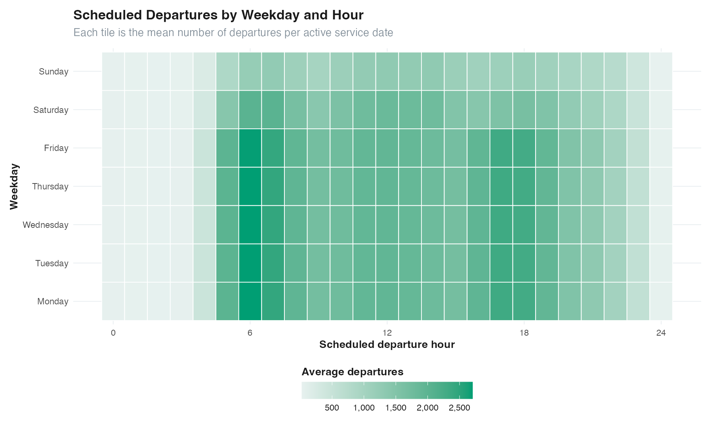

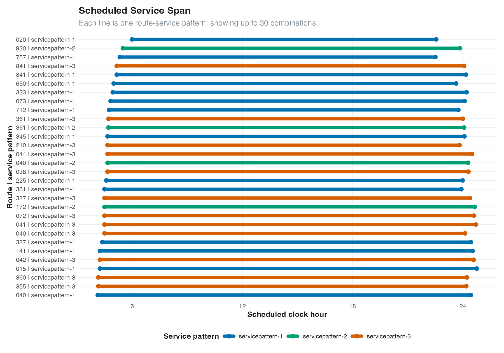

## Editing
GTFSwizard provides functions to edit GTFS data directly.
The `delay_trip()` function allows users to apply a delay to specific trips.
The `split_trip()` function equally divides a trip in `split` number of points, creating `split + 1` separate trips. This can be useful for analyzing partial routes or for simulating route adjustments.
The `edit_speed()` function adjusts the travel speeds between stops in a GTFS dataset by modifying trip durations based on a specified speed multiplier. It allows selective adjustments for specific trips and stops or applies changes globally.
The `set_dwelltime()` function overwrites dwell times preserving start time and end time of trips. The `edit_dwelltime()` function edit dwell times adjusting the total duration of trips.
The `merge_gtfs()` function combines two GTFS files, allowing for the integration of distinct GTFS datasets into a single dataset.

```r
# Delay trips by 5 minutes (300 seconds)
delayed_gtfs <- GTFSwizard::delay_trip(for_bus_gtfs, trip_id = for_bus_gtfs$trips$trip_id[1:2], delay = 300)

# Split a trip in 3 sections (2 splits)
split_gtfs <- GTFSwizard::split_trip(for_bus_gtfs, trip_id = for_bus_gtfs$trips$trip_id[1:2], split = 2)

# Merge two GTFS files into one
merged_gtfs <- GTFSwizard::merge_gtfs(for_bus_gtfs, for_rail_gtfs)

# Double the speed of all trips
faster_gtfs <- GTFSwizard::edit_speed(for_rail_gtfs, factor = 2)

# Set and edit dwell times for specific trips
gtfs <- set_dwelltime(for_rail_gtfs,                            
                   trips = for_rail_gtfs$trips$trip_id[1:100],
                   stops = for_rail_gtfs$stops$stop_id[1:20],
                   duration = 10)

gtfs <- edit_dwelltime(gtfs,                                    
                   trips = for_rail_gtfs$trips$trip_id[1:100],
                   stops = for_rail_gtfs$stops$stop_id[1:20],
                   factor = 1.5)

get_dwelltimes(gtfs, method = 'detailed')
```

Feeds are, then, exported using the `write_gtfs()` function. It saves a standard GTFS `.zip` file, located as declared.
``` r
GTFSwizard::write_gtfs(for_bus_gtfs, 'path-to-file.zip')
```

## Travel Time Matrix
GTFSwizard implements the `tidytransit::raptor()` algorithm that estimates travel time matrices from a `wizardgtfs` object and a few other arguments.

``` r
GTFSwizard::tidy_raptor(for_rail_gtfs, min_departure = '06:20:00', max_arrival = '09:40:00',
           dates = "2021-12-13", max_transfers = 2, keep = "all",
           stop_ids = '66')
```
## Handling Geographic Data
GTFSwizard autodetects and reconstructs missing shape tables using the `get_shapes()` function. Variations of this function can create `simple feature` objects from `stops` or `shapes` tables, using `get_stops_sf()` or `get_shapes_sf()` functions, or standard GTFS `shapes` data frames from simple-feature shape objects using `get_shapes_df()`. Because `get_shapes()` reconstructs geometry from stop sequences, shapes created after `filter_stop()` or `filter_time()` describe only the retained partial trips.

``` r
gtfs <- for_bus_gtfs

gtfs$shapes <- NULL

gtfs$shapes
#NULL

gtfs <- GTFSwizard::get_shapes(gtfs)

GTFSwizard::get_shapes_sf(for_bus_gtfs$shapes)

GTFSwizard::get_stops_sf(for_bus_gtfs$stops)
```
The `latlon2epsg()` function determines the appropriate UTM (Universal Transverse Mercator) EPSG code for a given `sf` object based on its centroid's latitude and longitude. This can be very useful for conveniently geoprocessing data in meters.

``` r
GTFSwizard::latlon2epsg(get_shapes_sf(for_bus_gtfs)$shapes)
```

## Objects
GTFSwizard features two toy examples, a small `for_rail_gtfs` `wizardgtfs` object, and a rather bigger `for_bus_gtfs` `wizardgtfs` object. They are real GTFS samples, the first being the urban subway system, and the second one the regular bus system; both for the city of Fortaleza, Brazil, on the 2020's.
``` r
gtfs <- GTFSwizard::for_bus_gtfs

plot(gtfs)
```
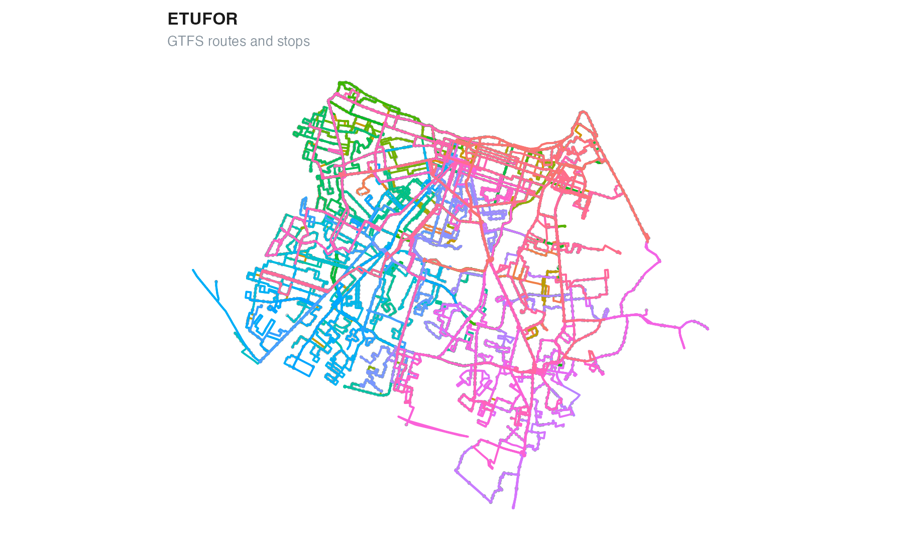

## Applications
The functions described facilitate the analysis, simulation, and evaluation of public
transportation systems. They assist the replication of real-world transit interventions, enabling
researchers, planners, and policymakers to test and refine system modifications in a controlled
and efficient manner. Key applications are outlined below along with their potential uses in
addressing typical challenges and opportunities in public transit systems.

- **Bus Rapid Transit (BRT) and Exclusive Lanes:** BRT systems often rely on exclusive
corridors to reduce travel times and enhance reliability. Using `edit_speed()`, users can
represent changes towards smaller travel times on these corridors by adjusting travel
speeds. In addition, `edit_dwelltime()` allows the representation of optimized boarding
and alighting processes, reflecting reduced dwell times at stations due to level boarding,
pre-payment mechanisms, or increased operational efficiency;

- **Frequency Modifications:** Frequency adjustments are among the most common transit
interventions. By using `filter_trip()` to select trips to be doubled, `delay_trip()` to
change its first departure_time, and `merge_gtfs()` to add them to the original GTFS,
users can represent increased frequencies, reflecting higher service levels. Conversely,
filter_trip can be used to reduce service frequencies, allowing for the evaluation of
cost-saving measures or temporary schedule adjustments;

- **Route Segmentation and Partial Adjustments:** With `split_trip()`, users can divide
existing routes into smaller segments, enabling partial route adjustments. This is
particularly relevant in studies assessing the feasibility of feeder services, route
rationalization, or service redundancy elimination.

- **Express Services:** Transit stops significantly influence travel times, operating costs, and
network coverage. Using `edit_dwelltime()` and `filter_stop()` can subtract dwell times from
total trip durations and remove unused stops, representing the introduction of express
services.

## Cheat Sheet
See the [GTFSwizard cheat sheet](inst/cheatsheet/GTFSwizard-cheatsheet.md) for a compact guide to the main workflow:
creating or reading feeds, selecting services, plotting operations, editing GTFS, exploring feeds interactively, and writing results.

## Contributing
Contributions are welcome! To report a bug, suggest a feature, or contribute code, please use the repository’s [Issues](https://github.com/OPATP/GTFSwizard/issues).

## Related Packages
GTFSwizard mainly uses [dplyr](https://CRAN.R-project.org/package=dplyr) for data handling, [sf](https://CRAN.R-project.org/package=sf) for spatial operations, and [ggplot2](https://CRAN.R-project.org/package=ggplot2) for static visualization. [shiny](https://CRAN.R-project.org/package=shiny) and [leaflet](https://CRAN.R-project.org/package=leaflet) are optional dependencies for `explore_gtfs()`. [tidytransit](https://CRAN.R-project.org/package=tidytransit), [data.table](https://CRAN.R-project.org/package=data.table), and [hms](https://CRAN.R-project.org/package=hms) are optional dependencies used only by `tidy_raptor()`.

## Citation
To cite package ‘GTFSwizard’ in publications use:

- Quesado Filho, N. O.; Guimaraes, C. G. C.; de Oliveira Neto, F. M. (2026). _GTFSwizard: Creating, Exploring and Manipulating GTFS Files._ R package version 1.2.1. [doi:10.32614/CRAN.package.GTFSwizard](https://cran.r-project.org/package=GTFSwizard).

A BibTeX entry for LaTeX users is
``` tex
  @Manual{quesado.guimaraes.oliveiraneto.2026,
    title = {GTFSwizard: Creating, Exploring and Manipulating GTFS Files},
    author = {N. O. {Quesado Filho} and C. G. C. {Guimaraes} and F. M. {de Oliveira Neto}},
    year = {2026},
    note = {R package version 1.2.1},
    url = {https://cran.r-project.org/package=GTFSwizard},
    doi = {10.32614/CRAN.package.GTFSwizard}}
```

## Related Publications
[QUESADO FILHO, N. de O.; GUIMARÃES, C. G. C.; OLIVEIRA NETO, F. M. de. GTFSwizard: a set of tools for exploring and manipulating general transit feed specification in R language. **CONTRIBUCIONES A LAS CIENCIAS SOCIALES**, [S. l.], v. 18, n. 1, p. e14620, 2025. DOI: 10.55905/revconv.18n.1-197.](https://ojs.revistacontribuciones.com/ojs/index.php/clcs/article/view/14620)

QUESADO FILHO, N. O.; GUIMARAES, C. G. C. ; OLIVEIRA NETO, F. M. . How to use GTFSwizard R Package to Assess Transit Projects: Fortaleza's BR-116 Bus Rapid Transit System Proposal. In: 39º Congresso de Pesquisa e Ensino em Transportes, 2025, Goiânia. Anais do 39º Congresso de Pesquisa e Ensino em Transportes, 2025.


## Acknowledgement  <a href="https://det.ufc.br/petran"></a>
**GTFSwizard** is developed by [Nelson Quesado](https://github.com/nelsonquesado/), [Caio Guimarães](https://github.com/cgmobility) and [Fco. Moraes](https://github.com/orgs/OPATP/people/OliveiraNetoFM) at OPA-TP research group, Universidade Federal do Ceará.
