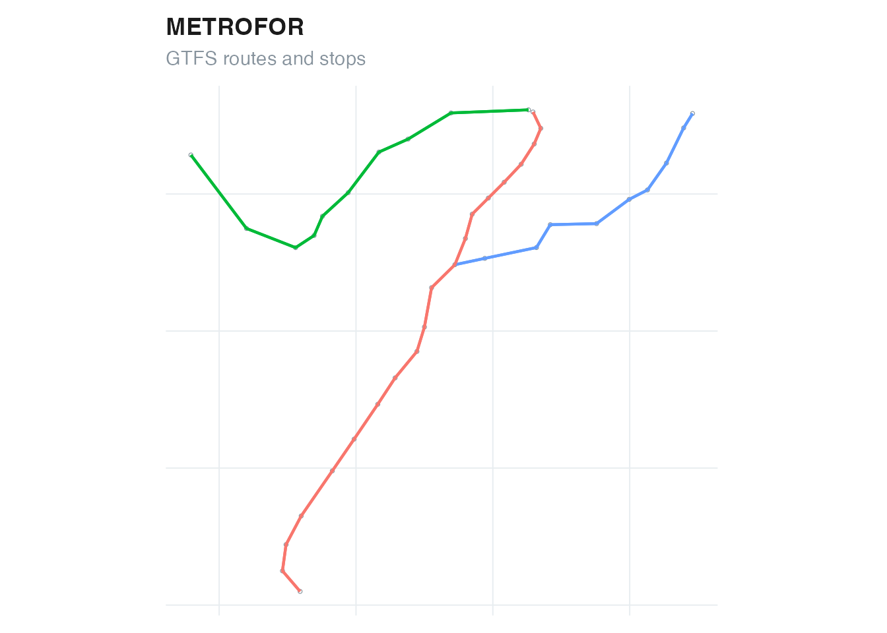

# Getting started with GTFSwizard

GTFSwizard creates, reads, validates, explores, edits, and exports
General Transit Feed Specification (GTFS) Schedule feeds. Its functions
work with a `wizardgtfs` object: a named list of GTFS tables plus a
`dates_services` table that connects calendar dates, services, and
service patterns.

## Use an included feed

The package includes two real, reduced examples from Fortaleza, Brazil.
`for_rail_gtfs` is small enough for learning and examples;
`for_bus_gtfs` is useful for checking workflows on a larger bus network.

``` r

library(GTFSwizard)

gtfs <- for_rail_gtfs
summary(gtfs)
#> <summary.wizardgtfs>
#>   Agency: METROFOR
#>   Service: 2020-01-02 to 2021-12-31 (614 active dates)
#>   3 routes; 215 trips; 39 stops; 6 shapes
#>   Median consecutive-stop spacing: 1144.6 m
#> 
#> Tables:
#>         agency       calendar calendar_dates         routes          stops 
#>              1              1             26              3             39 
#>     stop_times          trips         shapes 
#>           3420            215             80
```

Access an individual GTFS table with the usual list syntax.

``` r

head(gtfs$routes)
#> # A tibble: 3 × 9
#>   route_id route_short_name route_long_name      route_desc route_type route_url
#>   <chr>    <chr>            <chr>                <chr>           <int> <chr>    
#> 1 8        ""               VLT Parangaba Papicu ""                  1 ""       
#> 2 6        ""               Linha Sul            ""                  1 ""       
#> 3 7        ""               Linha Oeste          ""                  1 ""       
#> # ℹ 3 more variables: route_color <chr>, route_text_color <chr>,
#> #   agency_id <chr>
head(gtfs$stops)
#> # A tibble: 6 × 10
#>   stop_id stop_code stop_name       stop_desc stop_lat stop_lon zone_id stop_url
#>   <chr>   <chr>     <chr>           <chr>        <dbl>    <dbl> <chr>   <chr>   
#> 1 66      ""        Papicu          ""           -3.74    -38.5 ""      ""      
#> 2 65      ""        Antônio Sales   ""           -3.75    -38.5 ""      ""      
#> 3 64      ""        Pontes Vieira   ""           -3.75    -38.5 ""      ""      
#> 4 63      ""        São João do Ta… ""           -3.76    -38.5 ""      ""      
#> 5 41      ""        Borges de Melo  ""           -3.76    -38.5 ""      ""      
#> 6 40      ""        Vila União      ""           -3.77    -38.5 ""      ""      
#> # ℹ 2 more variables: location_type <int>, stop_timezone <chr>
```

## Read an existing feed

[`read_gtfs()`](https://opatp.github.io/GTFSwizard/reference/read_gtfs.md)
reads a GTFS zip archive and validates its required tables, fields,
identifiers, sequences, dates, and times. Supply the archive path
explicitly. To choose a file interactively, call
[`explore_gtfs()`](https://opatp.github.io/GTFSwizard/reference/explore_gtfs.md)
without a feed in an interactive R session.

``` r

gtfs <- read_gtfs("path/to/feed.zip")
explore_gtfs() # choose a zip file and open the dashboard
```

Use
[`as_wizardgtfs()`](https://opatp.github.io/GTFSwizard/reference/as_wizardgtfs.md)
when the GTFS tables are already available as a named list. If
`shapes.txt` is absent, the default behavior infers straight lines from
ordered stop coordinates for analysis and visualization.

``` r

converted <- as_wizardgtfs(unclass(for_rail_gtfs))
inherits(converted, "wizardgtfs")
#> [1] TRUE
```

## Create a feed from tables

[`create_gtfs()`](https://opatp.github.io/GTFSwizard/reference/create_gtfs.md)
validates the supplied tables using the same package rules. A feed must
define service using `calendar`, `calendar_dates`, or both.

``` r

created <- create_gtfs(
  agency = data.frame(
    agency_id = "A",
    agency_name = "Demo Transit",
    agency_url = "https://example.com",
    agency_timezone = "America/Fortaleza"
  ),
  routes = data.frame(
    route_id = "R1", agency_id = "A", route_short_name = "1",
    route_long_name = "Central", route_type = 3
  ),
  trips = data.frame(
    route_id = "R1", service_id = "WK", trip_id = "T1"
  ),
  stop_times = data.frame(
    trip_id = "T1",
    arrival_time = c("08:00:00", "08:10:00"),
    departure_time = c("08:00:00", "08:10:00"),
    stop_id = c("S1", "S2"),
    stop_sequence = 1:2
  ),
  stops = data.frame(
    stop_id = c("S1", "S2"),
    stop_name = c("First", "Second"),
    stop_lat = c(-3.73, -3.74),
    stop_lon = c(-38.52, -38.53)
  ),
  calendar = data.frame(
    service_id = "WK",
    monday = 1, tuesday = 1, wednesday = 1, thursday = 1,
    friday = 1, saturday = 0, sunday = 0,
    start_date = "20260101", end_date = "20261231"
  )
)
#> GTFSwizard: building straight-line shapes from ordered stop coordinates.

created
#> <wizardgtfs>
#>   Agency: Demo Transit
#>   1 routes; 1 trips; 2 stops
#> 
#> $agency [1 rows]
#> # A tibble: 1 × 4
#>   agency_id agency_name  agency_url          agency_timezone  
#>   <chr>     <chr>        <chr>               <chr>            
#> 1 A         Demo Transit https://example.com America/Fortaleza
#> 
#> $routes [1 rows]
#> # A tibble: 1 × 5
#>   route_id agency_id route_short_name route_long_name route_type
#>   <chr>    <chr>     <chr>            <chr>                <dbl>
#> 1 R1       A         1                Central                  3
#> 
#> $trips [1 rows]
#> # A tibble: 1 × 4
#>   route_id service_id trip_id shape_id
#>   <chr>    <chr>      <chr>   <chr>   
#> 1 R1       WK         T1      shape-1 
#> 
#> $stop_times [2 rows]
#> # A tibble: 2 × 5
#>   trip_id arrival_time departure_time stop_id stop_sequence
#>   <chr>   <chr>        <chr>          <chr>           <int>
#> 1 T1      08:00:00     08:00:00       S1                  1
#> 2 T1      08:10:00     08:10:00       S2                  2
#> 
#> $stops [2 rows]
#> # A tibble: 2 × 4
#>   stop_id stop_name stop_lat stop_lon
#>   <chr>   <chr>        <dbl>    <dbl>
#> 1 S1      First        -3.73    -38.5
#> 2 S2      Second       -3.74    -38.5
#> 
#> $calendar [1 rows]
#> # A tibble: 1 × 10
#>   service_id monday tuesday wednesday thursday friday saturday sunday start_date
#>   <chr>       <dbl>   <dbl>     <dbl>    <dbl>  <dbl>    <dbl>  <dbl> <date>    
#> 1 WK              1       1         1        1      1        0      0 2026-01-01
#> # ℹ 1 more variable: end_date <date>
#> 
#> $shapes [2 rows]
#> # A tibble: 2 × 5
#>   shape_id shape_pt_lat shape_pt_lon shape_pt_sequence shape_dist_traveled
#>   <chr>           <dbl>        <dbl>             <int>               <dbl>
#> 1 shape-1         -3.73        -38.5                 1                  0 
#> 2 shape-1         -3.74        -38.5                 2               1571.
```

## Inspect and plot

The print method previews tables,
[`summary()`](https://rdrr.io/r/base/summary.html) reports system-level
properties, and [`plot()`](https://rdrr.io/r/graphics/plot.default.html)
draws the network. Analytical functions return ordinary tibbles or `sf`
objects so they remain compatible with standard R workflows.

``` r

plot(gtfs)
#> Coordinate system already present.
#> ℹ Adding new coordinate system, which will replace the existing one.
```



## Export a feed

[`write_gtfs()`](https://opatp.github.io/GTFSwizard/reference/write_gtfs.md)
removes the internal `dates_services` table, restores standard GTFS date
and spatial columns, and writes a zip archive.

``` r

output <- tempfile(fileext = ".zip")
write_gtfs(created, output)
file.exists(output)
#> [1] TRUE
unlink(output)
```

Continue with [service
analysis](https://opatp.github.io/GTFSwizard/articles/service-analysis.md),
or learn how to [filter and edit
feeds](https://opatp.github.io/GTFSwizard/articles/filtering-editing.md).
