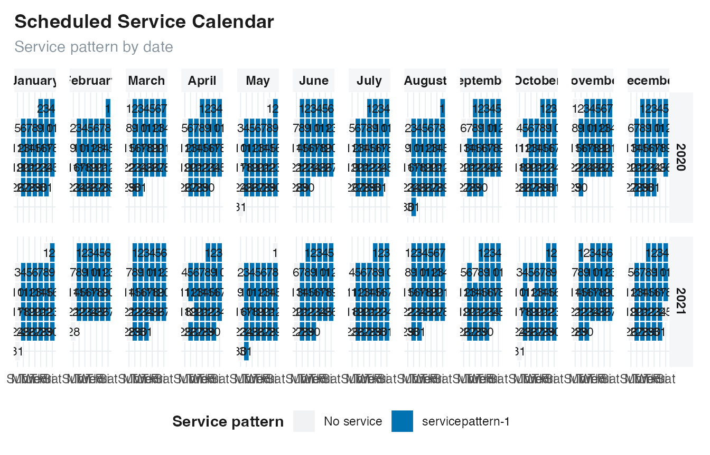
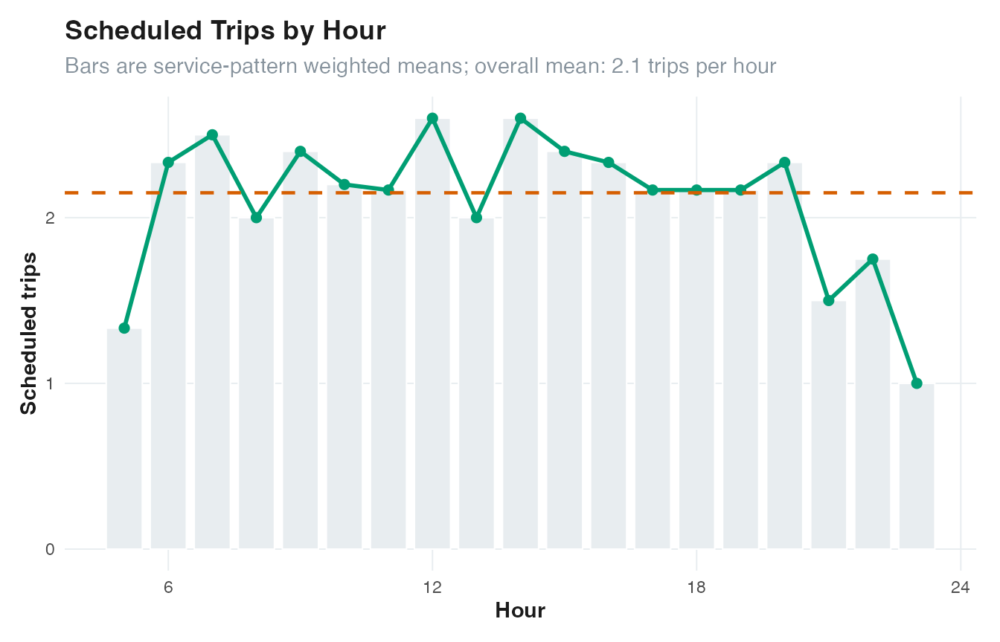
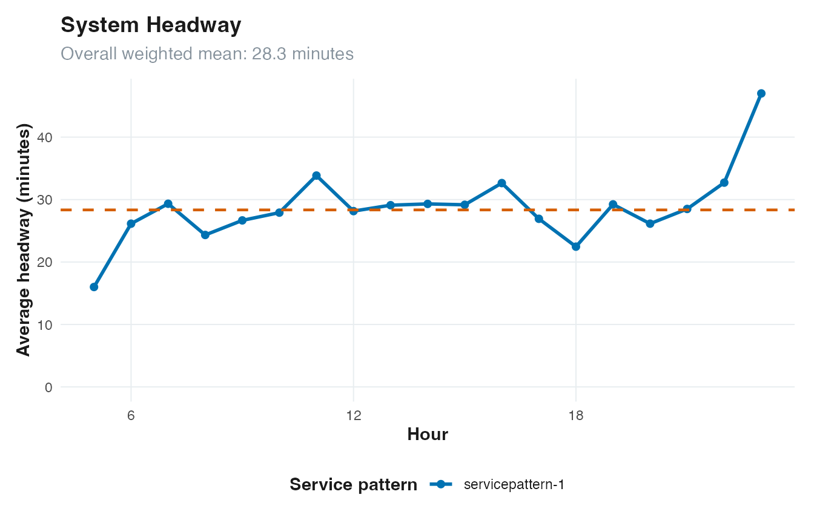

# Service analysis and visualization

GTFSwizard analyzes scheduled service. Results describe the timetable
rather than observed vehicle movements or passenger demand. Pay
attention to each function’s aggregation method because it defines the
observational unit.

## Service patterns

A GTFS `service_id` identifies one service calendar. Several IDs can
operate on the same date. GTFSwizard assigns the same `service_pattern`
to dates that have the exact same set of active services. Consequently,
one `service_id` can belong to several patterns when the services
operating alongside it change.

``` r

get_servicepattern(gtfs)
#> # A tibble: 2 × 3
#>   service_id service_pattern  pattern_frequency
#>   <chr>      <chr>                        <int>
#> 1 4          servicepattern-1               614
#> 2 NA         No service                     116
```

`pattern_frequency` is the number of dates represented by that exact
active service set. The most frequent active pattern is therefore a
useful default typical day, but it is not necessarily a weekday and
should be interpreted from the feed calendar.

``` r

plot_calendar(gtfs, fill = "service_pattern", facet_by_year = TRUE)
```



## Frequency and headway

Frequency counts scheduled departures. Headway measures elapsed minutes
between successive service instances in a comparable group. Route-level
results retain `direction_id` when it is available.

``` r

head(get_frequency(gtfs, method = "by_route"))
#> # A tibble: 6 × 5
#>   route_id direction_id service_pattern  pattern_frequency daily.frequency
#>   <chr>           <int> <chr>                        <int>           <int>
#> 1 6                   0 servicepattern-1               614              63
#> 2 6                   1 servicepattern-1               614              64
#> 3 7                   0 servicepattern-1               614              15
#> 4 7                   1 servicepattern-1               614              15
#> 5 8                   0 servicepattern-1               614              29
#> 6 8                   1 servicepattern-1               614              29
head(get_headways(gtfs, method = "by_route"))
#> # A tibble: 6 × 6
#>   route_id direction_id service_pattern  pattern_frequency headway_minutes
#>   <chr>           <int> <chr>                        <int>           <dbl>
#> 1 6                   0 servicepattern-1               614            17.0
#> 2 6                   1 servicepattern-1               614            16.8
#> 3 7                   0 servicepattern-1               614            62.1
#> 4 7                   1 servicepattern-1               614            62.1
#> 5 8                   0 servicepattern-1               614            37  
#> 6 8                   1 servicepattern-1               614            37  
#> # ℹ 1 more variable: valid_trips <int>
```

Common method names use underscores:

- `by_trip` returns one observation per trip;
- `by_route` aggregates by route, direction, and service pattern where
  applicable;
- `by_hour` aggregates scheduled service by hour;
- `detailed` returns stop-call or interval-level observations.

Check a function’s help page because not every method is meaningful for
every indicator.

``` r

plot_frequency(gtfs)
```



``` r

plot_headways(gtfs)
```



## Duration, distance, speed, dwell time, and fleet

Duration and distance are schedule and geometry properties. Speed
combines them, dwell time is departure minus arrival at a stop call, and
fleet counts simultaneously active scheduled trip instances.

``` r

head(get_durations(gtfs, method = "by_trip"))
#> # A tibble: 6 × 6
#>   route_id trip_id direction_id duration service_pattern  pattern_frequency
#>   <chr>    <chr>          <int>    <dbl> <chr>                        <int>
#> 1 7        10                 0     2400 servicepattern-1               614
#> 2 6        100                1     2160 servicepattern-1               614
#> 3 6        101                1     2160 servicepattern-1               614
#> 4 6        102                1     2160 servicepattern-1               614
#> 5 6        103                1     2160 servicepattern-1               614
#> 6 6        104                1     2160 servicepattern-1               614
head(get_distances(gtfs, method = "by_trip"))
#> # A tibble: 6 × 6
#>   route_id trip_id direction_id distance service_pattern  pattern_frequency
#>   <chr>    <chr>          <int>    <dbl> <chr>                        <int>
#> 1 7        4                  0   17550. servicepattern-1               614
#> 2 7        5                  0   17550. servicepattern-1               614
#> 3 7        6                  0   17550. servicepattern-1               614
#> 4 7        7                  0   17550. servicepattern-1               614
#> 5 7        8                  0   17550. servicepattern-1               614
#> 6 7        9                  0   17550. servicepattern-1               614
head(get_speeds(gtfs, method = "by_route"))
#> # A tibble: 6 × 6
#>   route_id direction_id trips average.speed service_pattern  pattern_frequency
#>   <chr>           <int> <int>         <dbl> <chr>                        <int>
#> 1 6                   0    63          38.3 servicepattern-1               614
#> 2 6                   1    64          38.3 servicepattern-1               614
#> 3 7                   0    15          26.3 servicepattern-1               614
#> 4 7                   1    15          25.7 servicepattern-1               614
#> 5 8                   0    29          21.9 servicepattern-1               614
#> 6 8                   1    29          21.9 servicepattern-1               614
head(get_dwelltimes(gtfs, method = "by_route"))
#> # A tibble: 6 × 6
#>   route_id direction_id trips average.dwelltime service_pattern 
#>   <chr>           <int> <int>             <dbl> <chr>           
#> 1 6                   0  1260                 0 servicepattern-1
#> 2 6                   1  1280                 0 servicepattern-1
#> 3 7                   0   150                 0 servicepattern-1
#> 4 7                   1   150                 0 servicepattern-1
#> 5 8                   0   290                 0 servicepattern-1
#> 6 8                   1   290                 0 servicepattern-1
#> # ℹ 1 more variable: pattern_frequency <int>
get_fleet(gtfs, method = "peak")
#> # A tibble: 3 × 4
#>   service_pattern  pattern_frequency  hour fleet
#>   <chr>                        <int> <dbl> <int>
#> 1 servicepattern-1               614    18    10
#> 2 servicepattern-1               614     6     9
#> 3 servicepattern-1               614     7     9
```

These are scheduled indicators. They do not estimate congestion,
reliability, vehicle availability, layover policy, deadheading, or
passenger loads unless those effects are already represented in the
feed.

## Spatial structure

The spatial helpers return standard `sf` objects. Inferred shapes and
corridor segments connect coordinates with straight lines; they are not
map-matched paths.

``` r

stops <- get_stops_sf(gtfs$stops)
shapes <- get_shapes_sf(gtfs$shapes)
nrow(stops)
#> [1] 39
nrow(shapes)
#> [1] 6
```

Hubs summarize stops by their scheduled trip and route connections.
Corridors join frequently served consecutive stop pairs and report
length in meters.

``` r

head(get_hubs(gtfs))
#> Simple feature collection with 6 features and 5 fields
#> Geometry type: POINT
#> Dimension:     XY
#> Bounding box:  xmin: -38.62687 ymin: -3.895013 xmax: -38.56387 ymax: -3.775791
#> Geodetic CRS:  WGS 84
#> # A tibble: 6 × 6
#>   stop_id trip_id     route_id  n_trip n_routes              geometry
#>   <chr>   <list>      <list>     <int>    <int>           <POINT [°]>
#> 1 28      <chr [185]> <chr [2]>    185        2 (-38.56387 -3.775791)
#> 2 27      <chr [127]> <chr [1]>    127        1 (-38.62042 -3.895013)
#> 3 26      <chr [127]> <chr [1]>    127        1  (-38.62687 -3.88752)
#> 4 25      <chr [127]> <chr [1]>    127        1 (-38.62556 -3.877935)
#> 5 24      <chr [127]> <chr [1]>    127        1 (-38.62003 -3.867487)
#> 6 23      <chr [127]> <chr [1]>    127        1 (-38.60866 -3.851034)
get_corridor(gtfs, i = 0.2, min_length = 100)
#> Simple feature collection with 1 feature and 4 fields
#> Geometry type: MULTILINESTRING
#> Dimension:     XY
#> Bounding box:  xmin: -38.62687 ymin: -3.895013 xmax: -38.53248 ymax: -3.720076
#> Geodetic CRS:  WGS 84
#> # A tibble: 1 × 5
#>   corridor   stop_id    trip_id     length                              geometry
#> * <chr>      <list>     <list>       <dbl>                 <MULTILINESTRING [°]>
#> 1 Corridor 1 <chr [20]> <chr [127]> 22953. ((-38.53248 -3.72603, -38.5349 -3.73…
```

Use
[`plot_hubs()`](https://opatp.github.io/GTFSwizard/reference/plot_hubs.md)
and
[`plot_corridor()`](https://opatp.github.io/GTFSwizard/reference/plot_corridor.md)
for the corresponding network views. The `i` argument is a share
threshold, not an absolute number of trips.

## Choosing a plot

- [`plot_calendar()`](https://opatp.github.io/GTFSwizard/reference/plot_calendar.md)
  shows active dates, trip counts, or service patterns.
- [`plot_frequency()`](https://opatp.github.io/GTFSwizard/reference/plot_frequency.md)
  and
  [`plot_headways()`](https://opatp.github.io/GTFSwizard/reference/plot_headways.md)
  show system service by hour.
- [`plot_routefrequency()`](https://opatp.github.io/GTFSwizard/reference/plot_routefrequency.md)
  compares routes with a readable `top_n` limit.
- [`plot_servicespan()`](https://opatp.github.io/GTFSwizard/reference/plot_servicespan.md)
  shows first departure and final arrival.
- [`plot_serviceheatmap()`](https://opatp.github.io/GTFSwizard/reference/plot_serviceheatmap.md)
  compares scheduled departures by weekday and hour.
- [`plot_routeduration()`](https://opatp.github.io/GTFSwizard/reference/plot_routeduration.md)
  compares trip-duration distributions.
- [`plot_servicesupply()`](https://opatp.github.io/GTFSwizard/reference/plot_servicesupply.md)
  compares scheduled vehicle-hours.

All plotting functions return `ggplot` objects, so labels and themes can
be extended with `ggplot2` when needed.
